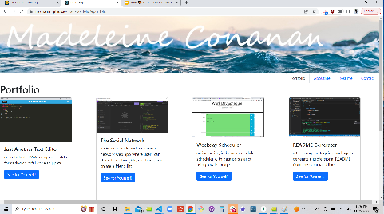

Module 20 Challenge: a react portfolio

This portfolio was created using react. First, pages were created for each of the navigation tabs.

Components were created to populate the pages with contect. For example, a project component was created so that props could be passed to it, and thus a bootstrap card of a project screencapture, title, description, and link to the repository. The project component was then placed in the Portfolio page. 

Header and Footer components were created so that a styled header and footer would persist throughout the website. 

The UseState react hook was used to handle state change, and to allow for navigation between the pages via the navtabs. 

link to GitHub Pages deployed website: https://mconanan.github.io/react-portfolio/#aboutMe
link to repository: https://github.com/mconanan/react-portfolio